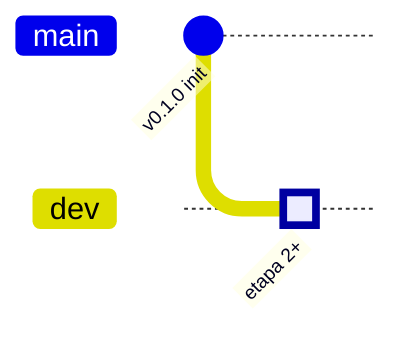

# Etapa 1 — Inicialización y Branching (mypropinmobiliarias)

## Situación Actual

La conversación previa (`691eb87d`) ya generó toda la infraestructura del proyecto. Sin embargo, **no se realizó ningún commit** y el repositorio está en la rama default `master` sin historial.

### ✅ Ya Completado (código existente verificado)

| Componente | Estado | Archivos |
|---|---|---|
| **Stack Técnico** | ✅ Instalado | Bun 1.3.10, Vite 6.4.1, React 19.2.4, TW4.2.2, TS 5.7.2 |
| **Tailwind v4 + Shadcn/ui** | ✅ Configurado | `index.css`, `components.json` (new-york, CSS vars) |
| **Paleta Renta520** | ✅ 10 tonos | `--color-renta-50` → `--color-renta-950` |
| **Tipografías** | ✅ 3 familias | Jakarta (títulos), Inter (body), Playfair (luxury) |
| **Layout Admin** | ✅ 3 componentes | `AdminLayout`, `Sidebar`, `Topbar` |
| **Dashboard** | ✅ KPI Cards | `DashboardPage` con StatCards animadas |
| **Multi-tenant** | ✅ Hook | `useInmobiliaria()` → Clerk publicMetadata |
| **Eden Treaty** | ✅ Client | `eden.ts` → mypropAPI v1.6.0 |
| **ClerkProvider** | ✅ Wrapper | Provider con validación de key |
| **CHANGELOG.txt** | ✅ v0.1.0 | Stack, visual, branching documentado |
| **NOTEBOOK_LM.md** | ✅ Docs | Documentación técnica para NotebookLM |
| **Animaciones** | ✅ 4 keyframes | fade-in-up, fade-in, slide-in-left, pulse-soft |
| **Utilities CSS** | ✅ 7 clases | luxury-glass, admin-card, admin-sidebar, etc. |

### ❌ Pendiente (lo que falta ejecutar)

| Tarea | Detalle |
|---|---|
| **Build verification** | Verificar que `bun run build` compila sin errores |
| **Rename master → main** | Renombrar rama default |
| **Commit inicial** | Crear primer commit en `main` |
| **Crear rama dev** | Branch `dev` desde `main` |
| **Checkout a dev** | Posicionar HEAD en `dev` para trabajo futuro |

---

## Propuestas de Cambios

### 1. Build Verification

Ejecutar `bun run build` para confirmar que TypeScript + Vite compilan sin errores. Si hay errores de tipos (ej: el `@ts-ignore` en `eden.ts` por el tipo `App` de mypropapi), se resolverán antes de commitear.

### 2. Git Branching Strategy



**Secuencia de comandos:**
1. `git branch -m master main` — Renombrar `master` → `main`
2. `git add .` — Staging de todos los archivos
3. `git commit -m "feat: v0.1.0 — Repository Initialization (Etapa 1)"` — Commit inicial
4. `git checkout -b dev` — Crear y posicionar en `dev`

> [!IMPORTANT]
> Tras la ejecución, el HEAD quedará en `dev`. Todo el desarrollo de etapas 2-7 ocurrirá exclusivamente en esta rama. Commits directos en `main` quedan **PROHIBIDOS** por política.

### 3. Archivos Excluidos del Commit

Los siguientes archivos existentes en el filesystem **NO** serán commiteados (cubiertos por `.gitignore`):

- `node_modules/` — Dependencias (se reconstruyen con `bun install`)
- `*.tsbuildinfo` — Cache de TypeScript
- `.env` — Variables sensibles (solo `.env.example` se commitea)

---

## Verificación

### Build automático
```bash
bun run build
```
Resultado esperado: `dist/` generado sin errores.

### Verificación de ramas
```bash
git branch -a
```
Resultado esperado: `main` y `* dev` (HEAD en dev).

### Verificación de estructura
```bash
git log --oneline --all --graph
```
Resultado esperado: un solo commit en `main`, `dev` apuntando al mismo commit.

---

## Árbol de Directorios Confirmado (AGCC_ANALIST)

```
mypropinmobiliarias/
├── .agent/                    → Configuración de agentes AI
│   ├── AGENTS/
│   ├── SKILLS/
│   └── rules/
├── .env.example               → Template de variables de entorno
├── .gitignore                  → Exclusiones de Git
├── CHANGELOG.txt               → Historial de versiones (v0.1.0)
├── NOTEBOOK_LM.md              → Documentación técnica
├── bun.lock                    → Lockfile de dependencias
├── components.json             → Config Shadcn/ui (new-york)
├── index.html                  → Entry point HTML (fonts, meta)
├── package.json                → Manifest (v0.1.0)
├── public/
│   └── favicon.svg             → Ícono del panel
├── src/
│   ├── App.tsx                 → Root component (Router + Layout)
│   ├── main.tsx                → React entry point
│   ├── vite-env.d.ts           → Tipos de Vite
│   ├── components/
│   │   └── layout/
│   │       ├── AdminLayout.tsx → Layout principal (sidebar + topbar + content)
│   │       ├── Sidebar.tsx     → Navegación lateral con ícono/texto
│   │       └── Topbar.tsx      → Header con search + tenant badge
│   ├── hooks/
│   │   └── useInmobiliaria.ts  → Master Filter hook (Clerk metadata)
│   ├── lib/
│   │   └── utils.ts            → cn() utility (clsx + twMerge)
│   ├── pages/
│   │   └── DashboardPage.tsx   → Dashboard con KPI StatCards
│   ├── providers/
│   │   └── ClerkProvider.tsx   → Auth wrapper (Clerk React)
│   ├── services/
│   │   └── eden.ts             → Eden Treaty client → mypropAPI
│   ├── styles/
│   │   └── index.css           → Design System (Renta520, animations)
│   └── types/
│       └── index.ts            → Tipos compartidos (NavItem, DashboardStat, TenantContext)
├── tsconfig.json               → TS config root
├── tsconfig.app.json           → TS config app (strict, paths)
├── tsconfig.node.json          → TS config node (Vite)
└── vite.config.ts              → Vite 6 + React + TW4 + alias
```

---

## Open Questions

> [!IMPORTANT]
> **¿Deseas que configure el remote de GitHub/origin?** Actualmente no hay ningún remote configurado. Si ya tienes el repositorio creado en GitHub, proporciona la URL para ejecutar `git remote add origin <url>`.

> [!NOTE]
> La protección de ramas (branch protection rules) en GitHub y la configuración de entornos en Railway son operaciones que requieren acceso a las plataformas web. ¿Deseas que documente los pasos recomendados o prefieres realizarlos manualmente?
